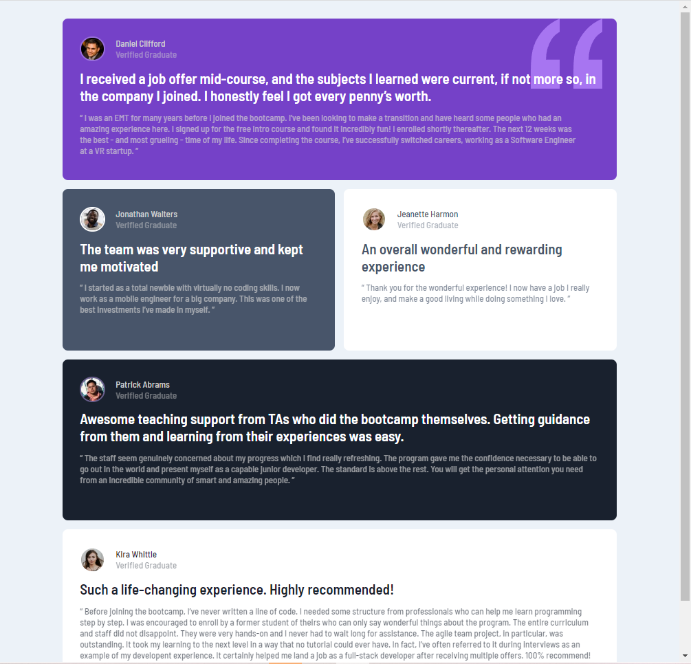
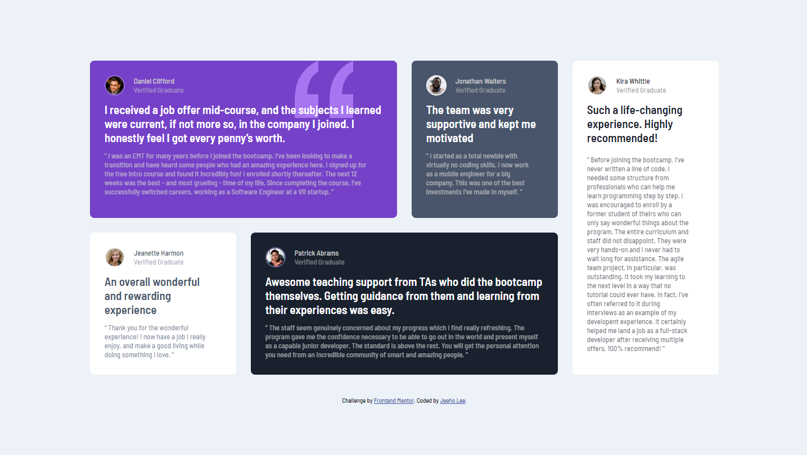

# Frontend Mentor - Testimonials grid section solution

This is a solution to the [Testimonials grid section challenge on Frontend Mentor](https://www.frontendmentor.io/challenges/testimonials-grid-section-Nnw6J7Un7). Frontend Mentor challenges help you improve your coding skills by building realistic projects. 

## Table of contents

- [Overview](#overview)
  - [The challenge](#the-challenge)
  - [Screenshot](#screenshot)
  - [Links](#links)
- [My process](#my-process)
  - [Built with](#built-with)
  - [What I learned](#what-i-learned)
  - [Continued development](#continued-development)
- [Author](#author)

## Overview

### The challenge

Users should be able to:

- View the optimal layout for the site depending on their device's screen size

### Screenshot

### Links

- Solution URL: [https://github.com/jeeheezy/FEM-Testimonials-Grid-Section](https://github.com/jeeheezy/FEM-Testimonials-Grid-Section)
- Live Site URL: [https://jeeheezy.github.io/FEM-Testimonials-Grid-Section/](https://jeeheezy.github.io/FEM-Testimonials-Grid-Section/)

## My process

### Built with

- Semantic HTML5 markup
- CSS custom properties
- Flexbox
- CSS Grid
- Mobile-first workflow

### What I learned

This was my first time setting the font-size at root level and seeing how the scaling is different when using rem. It was also my first time using grid-area instead of grid-column and grid-rows as separate properties. I'm often included to think of the columns first when working with grids, so I need to be mindful when using grid-area that it starts with grid-row first. 

### Continued development

While I'm becoming more comfortable with grid, it does sometimes behave in ways I do not expect, so I'd like to continue getting familiar with the tool. Additionally, I found I had to specify padding and margins on a lot of individual elements to get the result close to what was desired, so I'd like to learn how I can avoid that clutter. 

## Author

- LinkedIn - [Jeeho Lee](https://www.linkedin.com/in/jeeho-lee-719852182/)
- Frontend Mentor - [@jeeheezy](https://www.frontendmentor.io/profile/jeeheezy)
